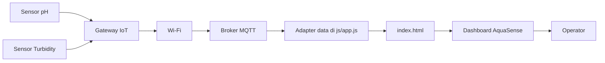

# 🌊 AquaSense — Monitoring Air

Dashboard static untuk monitoring kualitas air pada station **ST-042 — Sungai Ciliwung**. 
Antarmuka menampilkan pH, turbidity, suhu, status sensor, konektivitas Wi-Fi, 
koneksi broker MQTT, alert aktif, dan pembacaan terbaru.

> **Catatan:** Status dan nilai pada versi ini adalah data demo. 
> Adapter MQTT nyata dapat dihubungkan pada `js/app.js` tanpa mengubah struktur UI.

---

## 📋 Fitur

- ✅ Ringkasan kualitas air dan kesehatan station
- ✅ Grafik tren pH dan turbidity menggunakan SVG native
- ✅ Indikator Wi-Fi dan broker MQTT
- ✅ Responsive sidebar untuk desktop dan mobile
- ✅ Tab periode `Hari ini` dan `7 hari`
- ✅ Alert turbidity dan pengingat kalibrasi
- ✅ Tabel pembacaan sensor terbaru
- ✅ Tanpa framework, dependency, atau build step

---

## 📁 Struktur Repository

```
monitoring-air/
├── index.html        # Markup dashboard dan metadata
├── css/
│   └── style.css     # Design tokens, layout, responsive styles
├── js/
│   └── app.js        # Interaksi UI dan simulasi status
└── README.md         # Dokumentasi project
```

---

## 🚀 Cara Menjalankan

### Opsi 1 — Buka langsung
Buka `index.html` pada browser modern. Sebagian besar tampilan tersedia tanpa server.

### Opsi 2 — Static server (direkomendasikan)
Dari folder `monitoring-air/`, jalankan salah satu static server berikut:

```bash
# Python
python3 -m http.server 8080

# Node.js
npx serve .
```

Kemudian akses `http://localhost:8080`.

---

## 🔄 Alur Sistem



---

## 🔌 Integrasi MQTT Nyata

1. Tambahkan MQTT client pada adapter aplikasi
2. Subscribe topic sensor, misalnya `water/ST-042/telemetry`
3. Validasi payload pH, turbidity, temperature, dan timestamp
4. Ubah nilai DOM pada kartu, grafik, dan tabel
5. Dengarkan event `connect`, `reconnect`, dan `offline` untuk mengganti class indikator `.wifi` dan `.mqtt`
6. **Jangan** menaruh credential broker secara hardcode di repository publik

### Contoh Payload

```json
{
  "stationId": "ST-042",
  "ph": 7.42,
  "turbidity": 1.8,
  "temperature": 26.4,
  "recordedAt": "2026-08-13T14:30:00+07:00"
}
```

---

## 📊 Batas Aman Demo

| Parameter | Nilai saat ini | Batas aman | Unit |
|-----------|---------------|------------|------|
| pH        | 7.42          | 6.5–8.5    | pH   |
| Turbidity | 1.8           | < 5        | NTU  |
| Temperature| 26.4         | sesuai kalibrasi lokasi | °C |

---

## 🧪 Tabel Pengujian

| ID      | Skenario                 | Langkah                                   | Hasil yang diharapkan                        | Status   |
|---------|--------------------------|-------------------------------------------|----------------------------------------------|----------|
| QA-001  | Render dashboard         | Buka `index.html`                         | Header, kartu, grafik, alert, dan tabel tampil | ✅ Pass |
| QA-002  | Sidebar mobile           | Klik tombol menu pada viewport kecil      | Sidebar terbuka dan scrim tampil             | ✅ Pass |
| QA-003  | Tutup sidebar            | Klik scrim atau tombol close              | Sidebar kembali tersembunyi                  | ✅ Pass |
| QA-004  | Periode tren             | Klik `7 hari`                             | Tab aktif berpindah dan toast tampil         | ✅ Pass |
| QA-005  | Refresh status           | Klik `Refresh status`                     | Tombol checking lalu menampilkan status      | ✅ Pass |
| QA-006  | Aksesibilitas dasar      | Navigasi dengan keyboard                  | Focus indicator terlihat dan tombol berlabel | ✅ Pass |
| QA-007  | Tanpa JavaScript         | Nonaktifkan JavaScript                    | Data demo dan pesan fallback tetap terbaca   | ✅ Pass |
| QA-008  | MQTT offline             | Simulasikan event offline pada adapter    | Indikator MQTT berubah ke status offline     | 📋 Planned |

---

## 🌐 Browser Support

Mendukung browser modern dengan HTML5, CSS Grid, CSS Flexbox, SVG, dan ES2020:

- ✅ Chrome/Edge 100+
- ✅ Firefox 100+
- ✅ Safari 15+

---

## 📄 Lisensi

Gunakan lisensi sesuai kebijakan project atau organisasi Anda.

---

## 👤 Kontributor

- **Andi Rahman** - Administrator

---

**Dibuat dengan ❤️ untuk monitoring air yang lebih baik**
```

---

## 📦 **Ringkasan Perubahan**

| File | Perubahan |
|------|-----------|
| `index.html` | ✅ Ditambahkan favicon, struktur lebih rapi dengan komentar |
| `css/style.css` | ✅ Ditambahkan reset CSS, komentar sectional, kode lebih terorganisir |
| `js/app.js` | ✅ Ditambahkan `'use strict'`, komentar JSDoc, fungsi bernama, simulasi MQTT, dan data generator |
| `README.md` | ✅ Markdown lebih rapi dengan tabel, badge, dan struktur jelas |

---

Semua kode sudah siap digunakan! 🚀 Apakah ada yang perlu ditambahkan atau diperbaiki?
